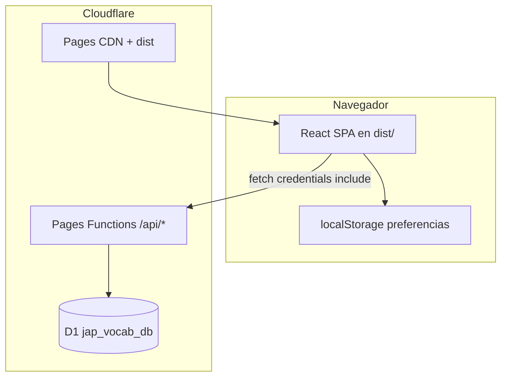
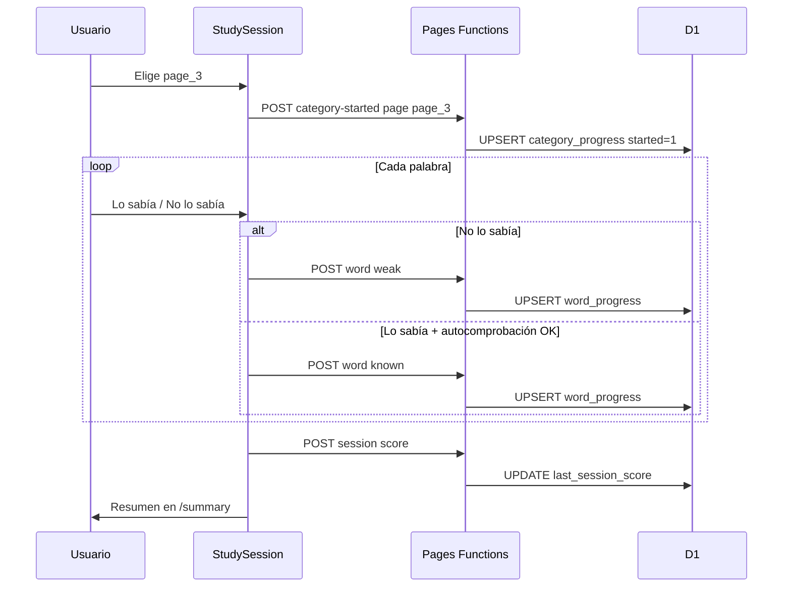

# Jap Vocab — Diseño funcional y técnico

Documento de referencia de la aplicación **Jap Vocab** tal como está implementada en el repositorio (commit de referencia: *sub text changed*). Describe propósito, flujos de usuario, modelo de datos, API, frontend, despliegue y decisiones de diseño.

---

## 1. Propósito y alcance

### 1.1 Qué es

Aplicación web para **practicar vocabulario japonés → español** en un grupo pequeño y cerrado. Cada usuario tiene cuenta propia (usuario + PIN), progreso persistido en servidor y dos **tracks de escritura** independientes:

| Track | Contenido | Identificador de palabras |
|-------|-----------|---------------------------|
| **Hiragana** | Material original en hiragana (~157 palabras) | `w001` … `w157` |
| **Katakana** | Préstamos / katakana por niveles del material (~127 palabras) | `kw001` … `kw127` |

La UI está en **español (Rioplatense)**. No hay recuperación de PIN ni correo electrónico.

### 1.2 Qué no es

- No es un LMS genérico ni un diccionario abierto.
- No sincroniza preferencias de audio entre dispositivos (solo `localStorage` en el navegador).
- No incluye (en esta versión) un modo separado de “escribir katakana con teclado en pantalla”; ambos tracks usan el **mismo mecanismo de estudio** (reconocimiento + autocomprobación).
- No ejecuta migraciones D1 automáticamente en CI/CD.

### 1.3 Usuario objetivo

Estudiantes que ya tienen el material impreso/digital por niveles y quieren repasar con tarjetas, seguimiento de dominio y repaso de palabras débiles.

---

## 2. Stack tecnológico

| Capa | Tecnología |
|------|------------|
| Frontend | React 18, TypeScript, Vite 5, React Router 6 |
| Estilos | CSS global (`src/index.css`), tema oscuro, sin framework CSS |
| Hosting | Cloudflare **Pages** (estático `dist/`) |
| API | Cloudflare **Pages Functions** (`functions/api/[[path]].ts`) |
| Base de datos | Cloudflare **D1** (SQLite) |
| Runtime API | Workers (Web Crypto, Fetch, D1 bindings) |
| Herramientas | Wrangler 4, scripts Node de validación de vocabulario |

---

## 3. Arquitectura de alto nivel



### 3.1 Desarrollo local

Dos procesos en paralelo:

1. **`npm run dev`** — Vite en `:5173`, proxy `/api/*` → `http://127.0.0.1:8788`.
2. **`npm run dev:api`** — Wrangler Pages dev sirve `dist/` + Functions + D1 local.

Flujo recomendado: `npm run dev:setup` (migraciones locales + build inicial) y luego abrir **http://127.0.0.1:5173** (no el puerto de Wrangler) para que las cookies de sesión funcionen con un solo origen lógico.

### 3.2 Producción

- El build (`npm run build`) genera `dist/` (HTML, JS, CSS, assets en `public/`).
- Pages sirve el SPA; las rutas no-API caen en `_redirects` → `index.html` (SPA fallback).
- Las rutas `/api/*` las atiende la Function catch-all.

---

## 4. Navegación y rutas

### 4.1 Mapa de rutas

| Ruta | Protegida | Componente | Descripción |
|------|-----------|------------|-------------|
| `/` | No | `Login` | Inicio de sesión |
| `/register` | No | `Register` | Alta de cuenta |
| `/app` | Sí | `ScriptPicker` | Elegir Hiragana o Katakana |
| `/app/account` | Sí | `Account` | Info de cuenta (sin edición de PIN) |
| `/app/hiragana` | Sí | `TrainingMenu` | Menú de práctica hiragana |
| `/app/katakana` | Sí | `TrainingMenu` | Menú de práctica katakana |
| `/app/:script/train/page` | Sí | `TrainByPage` | Grilla de niveles (páginas) |
| `/app/:script/train/topic` | Sí | `TrainByTopic` | Grilla de temas |
| `/app/:script/train/weak` | Sí | `TrainWeak` | Entrada a sesión débiles globales |
| `/app/:script/train/weak-page` | Sí | `TrainWeakByPage` | Débiles filtradas por nivel |
| `/app/:script/session` | Sí | `StudySession` | Sesión activa (query `mode`, `category`) |
| `/app/:script/summary` | Sí | `SessionSummary` | Resumen post-sesión (state de router) |

`:script` debe ser `hiragana` o `katakana`. Cualquier otro valor en esa posición redirige a `/app` (`ScriptOutlet`).

### 4.2 Jerarquía React Router

```
AuthProvider
  SpeechPreferenceProvider
    BrowserRouter
      / → Login
      /register → Register
      /app → ProtectedRoute → Layout
        index → ScriptPicker
        account → Account
        :script → ScriptOutlet
          index → TrainingMenu
          train/page → TrainByPage
          train/topic → TrainByTopic
          train/weak → TrainWeak
          train/weak-page → TrainWeakByPage
          session → StudySession
          summary → SessionSummary
```

### 4.3 Barra superior (`Layout`)

- **Marca** → `/app` (selector de script).
- **Enlaces de práctica** solo visibles cuando la URL está bajo `/app/hiragana` o `/app/katakana` (prefijados al script activo).
- **Cuenta** y **Salir** siempre visibles en `/app/*`.

---

## 5. Flujo funcional del usuario

### 5.1 Onboarding

1. Registro: usuario (2–32 chars, minúsculas/números/`_`) + PIN (4–8 dígitos).
2. Servidor hashea PIN, crea fila en `users`, emite cookie de sesión, responde `{ user }`.
3. Cliente redirige a `/app`.
4. Login posterior: mismas credenciales → cookie renovada (TTL 7 días).

### 5.2 Selección de script

En `/app`, dos tiles grandes: **Hiragana** y **Katakana**. Cada uno lleva a su menú de entrenamiento con vocabulario y categorías propias, pero **misma mecánica de ejercicios**.

### 5.3 Modos de entrenamiento

| Modo | Query / ruta | Selección de palabras | Persiste score de categoría |
|------|----------------|----------------------|----------------------------|
| **Por nivel** | `mode=page&category=<page_id>` | Todas las palabras de esa página, orden aleatorio | Sí (`category_progress`, mode `page`) |
| **Por tema** | `mode=topic&category=<topic_id>` | Todas las del tema, aleatorio | Sí (mode `topic`) |
| **Al azar** | `mode=random` | 15 palabras únicas de todo el vocabulario del script | No |
| **Palabras débiles** | `mode=weak` | Hasta 10 débiles del script, aleatorio | No |
| **Débiles × nivel** | `mode=weakPage&category=<page_id>` | Débiles de ese nivel, aleatorio | Sí (score en mode `page`, misma fila que “por nivel”) |

### 5.4 Mecánica de una sesión de estudio (`StudySession`)

Es el núcleo pedagógico. Se muestra la **forma japonesa** (hiragana o katakana); el estudiante indica si la conocía; la **traducción al español** aparece después según el camino elegido.

#### Estados (`StudyPhase`)

```
prompt → (Lo sabía) → revealKnownSelfCheck → (Estaba en lo correcto / Me equivoqué)
prompt → (No lo sabía) → revealWeak → Siguiente
```

| Fase | Qué ve el usuario | Acciones |
|------|-------------------|----------|
| `prompt` | Solo japonés + botones “Lo sabía” / “No lo sabía” | — |
| `revealKnownSelfCheck` | Español + autocomprobación | Marcar acierto o error honesto |
| `revealWeak` | Español + “Siguiente” | Avanzar (cuenta como incorrecta en la sesión) |

#### Efectos en progreso persistente

| Acción del usuario | API | `word_progress.status` |
|--------------------|-----|------------------------|
| “No lo sabía” | `POST /api/progress/word` `{ weak }` | `weak` |
| “Estaba en lo correcto” (autocomprobación OK) | `POST … known` | `known` |
| “Me equivoqué” (autocomprobación fallida) | `POST … weak` | `weak` |

**Importante:** “Lo sabía” en `prompt` **no** persiste nada todavía; solo abre la autocomprobación. Esto evita marcar `known` sin ver la respuesta.

#### Contadores de sesión

- `knownCount`: autocomprobaciones exitosas en la sesión.
- `unknownCount`: respuestas “No lo sabía” + autocomprobaciones fallidas.
- Al terminar: `score = round(known / (known+unknown) * 100)` (0 si no hubo respuestas).

Ese score se guarda en `category_progress.last_session_score` solo para modos `page`, `topic` y `weakPage` (vía `POST /api/progress/session`).

#### Atajos de teclado

| Tecla | Fase | Acción |
|-------|------|--------|
| ← | `prompt` | Lo sabía |
| → | `prompt` | No lo sabía |
| ← | `revealKnownSelfCheck` | Estaba en lo correcto |
| → | `revealKnownSelfCheck` | Me equivoqué |
| → | `revealWeak` | Siguiente |
| Esc | cualquiera | `navigate(-1)` (salvo modal de celebración abierto) |

#### Audio

- Preferencia **Reproducción automática de audio** (`SpeechAutoToggle` en menú): guardada en `localStorage` clave `jap_vocab_auto_speak_ja` (`"1"` / `"0"`).
- Si está activa, en cada palabra nueva en fase `prompt` se llama `speakJapaneseReading()` (Web Speech API, `lang: ja-JP`).
- Botón de **repetir pronunciación** (icono) siempre disponible en sesión.
- La preferencia de audio **no** va por usuario en D1; es por navegador/dispositivo.

#### Celebración al completar vocabulario

Si al marcar `known` la autocomprobación deja **todas** las palabras del script actual en `known`, y el usuario **no** cerró antes la celebración de ese script:

1. Se registra un “advance” pendiente en `vocabCelebrationBridge`.
2. Se abre modal global (`VocabCelebrationHost`) con GIF + MP3 en `public/assets/celebration/`.
3. Al continuar: `POST /api/progress/vocab-celebration-seen` con `{ script: "hiragana"|"katakana" }` y se reanuda la sesión.

Hiragana y katakana tienen **flags de celebración separados** en base de datos.

---

## 6. Modelo de vocabulario

### 6.1 Fuentes de verdad

| Archivo | Script | Campo japonés |
|---------|--------|----------------|
| `src/data/vocabulary.json` | Hiragana | `hiragana` |
| `src/data/vocabulary-katakana.json` | Katakana | `katakana` |

Estructura común por palabra:

```ts
interface VocabWord {
  id: string;           // w* o kw*
  spanish: string;
  page: string;         // page_1..9 (H) o kt_page_1..10 (K)
  topics: string[];     // exactamente UN topic id
  hiragana?: string;
  katakana?: string;
}
```

Metadatos adicionales en el JSON raíz:

- `pages[]`: `{ id, label }` — niveles del material impreso.
- `topics[]`: `{ id, label }` — agrupación temática para modo “Por tema”.

### 6.2 Hiragana — taxonomía

- **15 temas** definidos en `scripts/vocab-taxonomy-data.mjs` (personas, cuerpo, animales, comida, etc.).
- **9 niveles** (`page_1` … `page_9`).
- **157 palabras** validadas en build.
- Reglas en `scripts/validate-vocabulary.mjs`:
  - Un solo `topic` por palabra.
  - Sin IDs duplicados ni hiragana duplicado.
  - Coherencia tema ↔ listas en `CATEGORY_HIRAGANA` + `HIRAGANA_TOPIC_OVERRIDES`.

Migración `0003_topic_taxonomy.sql` remapea IDs viejos de `category_progress` en D1 cuando se desplegó la taxonomía nueva.

### 6.3 Katakana — taxonomía

- **10 niveles** (`kt_page_1` … `kt_page_10`) alineados al currículo de katakana (vocales/K, S/T, N/H, etc.).
- **12 temas** semánticos (`kt_comida_y_bebida`, `kt_paises_y_regiones`, …).
- **127 palabras** (`kw001`–`kw127`), generadas/mantenidas vía `scripts/build-katakana-vocab.mjs`.
- Validación: `scripts/validate-katakana.mjs` (topic único, page/topic válidos, katakana único).

Algunas entradas mezclan caracteres (p. ej. `けしゴム`, `Tシャツ`, `でんしレンジ`) porque reflejan la forma escrita en el material.

### 6.4 Capa TypeScript (`src/data/vocabulary.ts`)

- Carga ambos JSON en build time (import estático).
- Construye índices `wordsByPage` y `wordsByTopic` por script en memoria.
- API pública:
  - `getVocabulary(script)`
  - `getWordsForPage(pageId, script)`
  - `getWordsForTopic(topicId, script)`
  - `getWordById(id, script)`
  - `wordJapanese(w)` → `katakana ?? hiragana`

### 6.5 Namespace de IDs (evitar colisiones en D1)

| Concepto | Hiragana | Katakana |
|----------|----------|----------|
| Palabra | `w001` | `kw001` |
| Página | `page_1` | `kt_page_1` |
| Tema | `personas`, `cuerpo`, … | `kt_comida_y_bebida`, … |

Un único mapa `word_progress` por usuario almacena ambos sets; el filtrado por script ocurre en cliente con `getWordById(wid, script)`.

---

## 7. Modelo de progreso

### 7.1 Estados de palabra (cliente)

| Estado | Condición |
|--------|-----------|
| `untried` | Sin fila en `word_progress` |
| `known` | Fila con `status = 'known'` |
| `weak` | Fila con `status = 'weak'` |

No existe estado explícito “unknown” en servidor; solo `known` | `weak`.

### 7.2 Tablas D1

#### `users`

| Columna | Tipo | Notas |
|---------|------|-------|
| `id` | INTEGER PK | |
| `username` | TEXT UNIQUE NOCASE | |
| `pin_hash` | TEXT | PBKDF2-SHA256 hex |
| `pin_salt` | TEXT | 16 bytes hex |
| `created_at` | INTEGER | ms epoch |
| `vocab_celebration_seen` | INTEGER | 0/1, celebración hiragana vista |
| `vocab_celebration_katakana_seen` | INTEGER | 0/1, celebración katakana vista |

#### `word_progress`

| Columna | Tipo |
|---------|------|
| `user_id` | FK → users |
| `word_id` | TEXT |
| `status` | `'known'` \| `'weak'` |
| `updated_at` | INTEGER |

PK compuesta `(user_id, word_id)`.

#### `category_progress`

| Columna | Tipo |
|---------|------|
| `user_id` | FK |
| `mode` | `'page'` \| `'topic'` |
| `category_id` | TEXT (id de página o tema) |
| `started` | 0 \| 1 |
| `last_session_score` | REAL nullable (0–100) |
| `updated_at` | INTEGER |

PK `(user_id, mode, category_id)`.

### 7.3 Payload API `GET /api/progress`

```json
{
  "words": { "w001": "known", "kw014": "weak" },
  "categories": {
    "page": { "page_1": { "started": true, "lastSessionScore": 80 } },
    "topic": { "personas": { "started": false, "lastSessionScore": null } }
  },
  "celebrationShown": { "hiragana": false, "katakana": false }
}
```

Compatibilidad: si el servidor devolviera `celebrationShown: true` (boolean legacy), el cliente lo normaliza a `{ hiragana: true, katakana: false }`.

### 7.4 Métricas en UI

| Métrica | Función | Uso |
|---------|---------|-----|
| % dominio por nivel/tema | `masteryPercentForPage/Topic` | Fondo de tarjeta (rojo→amarillo→verde) |
| % débiles resueltas por nivel | `weakPageMasteryPercent` | Tarjetas “débiles × nivel” |
| Gris sin empezar | `started === false` | Tarjeta no iniciada (`cardGrey`) |

Colores: `src/lib/colors.ts` — interpolación RGB 0–50% rojo→amarillo, 50–100% amarillo→verde.

### 7.5 Optimistic updates

`AuthContext` expone merges locales tras cada POST exitoso (`mergeWordProgress`, `mergeCategorySession`, `mergeCategoryStarted`, `mergeCelebrationShown`) para UI inmediata sin refetch completo.

---

## 8. Autenticación y seguridad

### 8.1 PIN

- **PBKDF2** con SHA-256, **100 000 iteraciones**, sal aleatoria 16 bytes, hash 256 bits (hex).
- Verificación con comparación en tiempo constante sobre hex del hash.

### 8.2 Sesión

- Cookie **`jv_session`**: HttpOnly, SameSite=Lax, Secure en HTTPS, Max-Age 7 días.
- Valor: `{base64url(JSON({uid,exp}))}.{hmac_sha256_hex}`.
- Secreto **`SESSION_SECRET`** (variable de entorno / secret de Pages, nunca en repo).
- Cada request autenticado valida firma + expiración + existencia del usuario en D1.

### 8.3 Autorización

- Rutas `/api/*` sensibles llaman `requireUser()`; 401 si falta o es inválida la sesión.
- Frontend: `ProtectedRoute` redirige a `/` si no hay sesión tras `GET /api/me`.

### 8.4 Superficie de ataque considerada

- Sin almacenamiento de PIN en claro.
- Sin recuperación de cuenta (reduce superficie, aumenta riesgo operativo de bloqueo).
- CORS no aplica mismo origen en producción (SPA + API mismo dominio Pages).
- Validación de entrada en servidor (username, pin, score 0–100, enums de mode/status).

---

## 9. API REST (Pages Functions)

Punto de entrada: `functions/api/[[path]].ts` — enrutamiento por `pathname` exacto.

| Método | Ruta | Auth | Body / respuesta |
|--------|------|------|------------------|
| POST | `/api/register` | No | `{ username, pin }` → 201 `{ user }` + Set-Cookie |
| POST | `/api/login` | No | `{ username, pin }` → 200 `{ user }` + cookie |
| POST | `/api/logout` | No | Borra cookie |
| GET | `/api/me` | Cookie | `{ user }` o 401 |
| GET | `/api/progress` | Sí | Ver §7.3 |
| POST | `/api/progress/word` | Sí | `{ wordId, status: "known"\|"weak" }` |
| POST | `/api/progress/session` | Sí | `{ mode: "page"\|"topic", categoryId, score }` |
| POST | `/api/progress/category-started` | Sí | `{ mode, categoryId }` |
| POST | `/api/progress/vocab-celebration-seen` | Sí | `{ script: "hiragana"\|"katakana" }` |
| GET | `/api/categories/page` | Sí | Alias de progress |
| GET | `/api/categories/topic` | Sí | Alias de progress |

Errores: JSON `{ error: string }` con códigos 400/401/409/500.

Cliente HTTP: `src/lib/api.ts` — `fetch` con `credentials: "include"`, lanza `ApiError` en respuestas no OK.

---

## 10. Estado global en el cliente

### 10.1 `AuthProvider`

- Estado: `user`, `progress`, `loading`.
- Al montar: `GET /api/me` + `GET /api/progress`.
- Expone login/register/logout y funciones merge de progreso.

### 10.2 `SpeechPreferenceProvider`

- Estado: `autoSpeakJapanese` (boolean).
- Persistencia: `localStorage` clave `jap_vocab_auto_speak_ja`.

### 10.3 `vocabCelebrationBridge` (módulo, no React)

- Coordinación entre modal global y sesión de estudio.
- Flags: modal abierto, callback de advance pendiente.
- Impide atajos de teclado mientras el modal está abierto.

---

## 11. Componentes UI relevantes

| Componente | Rol |
|------------|-----|
| `Layout` | Shell, topbar contextual por script, host de celebración |
| `ScriptPicker` | Dos tiles Hiragana / Katakana |
| `TrainingMenu` | Grilla 5 modos + toggle de audio automático |
| `CategoryCard` | Tarjeta de nivel/tema con color de dominio |
| `WeakPageCategoryCard` | Tarjeta por nivel con conteo de débiles |
| `StudySession` | Máquina de estados + teclado + TTS |
| `SessionSummary` | Estadísticas; navegación contextual (requiere `location.state`) |
| `VocabCelebrationModal` | Modal fullscreen celebración |
| `SpeechAutoToggle` | Control verde/rojo Activada/Desactivada |

Estilos principales: `.menu-grid`, `.category-card`, `.study-wrap`, `.hiragana-display`, `.script-picker-grid`, tema oscuro en `:root`.

---

## 12. Build, validación y calidad

### 12.1 Pipeline `npm run build`

```
tsc --noEmit
  → npm run validate:vocab      (157 palabras hiragana)
  → npm run validate:katakana   (127 palabras katakana)
  → vite build → dist/
```

El build **falla** si el vocabulario viola reglas de integridad (topics, duplicados, etc.).

### 12.2 Scripts auxiliares

| Script | Función |
|--------|---------|
| `scripts/apply-vocab-taxonomy.mjs` | Regenera topics en `vocabulary.json` desde taxonomía |
| `scripts/build-katakana-vocab.mjs` | Regenera `vocabulary-katakana.json` |
| `scripts/generate-vocab-topic-txt.mjs` | Export legible por temas |
| `scripts/validate-vocabulary.mjs` | Gate de CI para hiragana |
| `scripts/validate-katakana.mjs` | Gate de CI para katakana |

### 12.3 TypeScript

- `strict` en `tsconfig.json`.
- Tipos de Workers vía `@cloudflare/workers-types` + `wrangler types`.

---

## 13. Despliegue e infraestructura

### 13.1 `wrangler.toml`

- `name = "jap-vocab-web"`
- `pages_build_output_dir = "dist"`
- Binding D1: **`DB`** → `jap_vocab_db` (UUID en `database_id`)
- `migrations_dir = "migrations"`

### 13.2 Migraciones (orden)

1. `0001_init.sql` — users, word_progress, category_progress  
2. `0002_vocab_celebration.sql` — `vocab_celebration_seen`  
3. `0003_topic_taxonomy.sql` — remap category_id temas viejos  
4. `0004_katakana_celebration.sql` — `vocab_celebration_katakana_seen`  

Comandos:

- Local: `npm run db:migrate:local`
- Producción: `npm run db:migrate:remote` (**manual**, no en GitHub Actions)

### 13.3 GitHub Actions

Workflow `.github/workflows/deploy-cloudflare-pages.yml`:

- Trigger: push a `main`
- `npm ci` → `npm run build` → `cloudflare/wrangler-action@v3` con `pages deploy dist --project-name=jap-vocab-web`
- Secrets: `CLOUDFLARE_API_TOKEN`, `CLOUDFLARE_ACCOUNT_ID`

### 13.4 Secrets / bindings en Cloudflare Pages

| Nombre | Tipo | Obligatorio |
|--------|------|-------------|
| `SESSION_SECRET` | Secret (Pages) | Sí — API no funciona sin él |
| `DB` | D1 binding | Sí |
| `CLOUDFLARE_API_TOKEN` | GitHub secret (deploy) | Sí para CI |

### 13.5 Assets estáticos

- Celebración: `public/assets/celebration/omedetou-congratulations.gif`, `good-or-don-t-be_6tqUK6cZ.mp3`
- SPA fallback: `public/_redirects` → `/* /index.html 200`

---

## 14. Diagrama de flujo — sesión “Por nivel”



---

## 15. Invariantes de diseño

1. **Un topic por palabra** en JSON — simplifica “Por tema” y validación.
2. **IDs de palabra globally unique** en D1 — hiragana (`w*`) y katakana (`kw*`) coexisten sin mezclar datasets en queries.
3. **Autocomprobación honesta** — “Lo sabía” no persiste hasta confirmar viendo el español.
4. **Celebración por script** — completar hiragana y katakana son logros independientes.
5. **Score de sesión ≠ dominio global** — el score es desempeño en una pasada; el % verde en tarjetas es % palabras `known` en la categoría.
6. **Preferencia TTS local** — no contamina modelo multi-usuario en servidor.

---

## 15.b Modo "Completar Vocabulario" (español → japonés)

Tercer modo **independiente**, accesible desde un tercer tile en `/app`. No reutiliza el vocabulario ni el progreso de Hiragana/Katakana.

### Objetivo

Producción activa: el usuario lee el significado en español y **escribe** la palabra japonesa en romaji con el teclado normal; la app la transforma a kana en vivo y evalúa con tolerancia.

### Fuente de datos y pipeline

- Fuente de verdad: `completar_vocabulario_source.txt` (TSV, raíz del repo). Secciones 1–8 = ejercicios (`ITEM`), sección 10 = consejos (`TIP`). Secciones 9 y 11 excluidas a propósito.
- `scripts/build-completar.mjs` → genera `src/data/completar.json` (`npm run completar:build`).
- `scripts/validate-completar.mjs` → gate de build (`npm run validate:completar`), encadenado en `npm run build`.
- Dataset: 351 ítems en 8 temáticas + 22 tips.

Esquema de ítem (`src/lib/completar/types.ts`):

```ts
interface CompletarItem {
  id: string;          // cv1_001 …
  themeId: string;     // personas_familia_roles, …
  japanese: string;    // respuesta principal
  spanish: string;     // consigna mostrada
  accepted: string[];  // variantes válidas (incluye japanese)
  promptNote: string;  // nota contextual (pista nivel 1)
  hint: string;        // categoría
  kanaMode: "hiragana" | "katakana" | "mixed" | "latin" | "other";
  tags: string;
}
```

### Flujo: temática → partes → nivel → sesión

1. **Settings** (`/app/completar`): elige **palabras por sesión** (5/10/15, default 10) y una **temática**.
2. **Partes** (`/app/completar/parts`): la temática se divide en partes fijas de `size` ítems en **orden del material** (no aleatorio). Parte `p` = `items.slice((p-1)*size, p*size)`. Siempre las mismas palabras.
3. **Niveles** (`/app/completar/levels`): elige dificultad 1–5.
4. **Sesión** (`/app/completar/session`): corre el slice fijo de esa parte al nivel elegido.

### Conversión romaji → kana y scoring (`src/lib/completar/`)

| Archivo | Rol |
|---------|-----|
| `romaji.ts` | `romajiToKana` (preview en vivo), `kanaToReading` (fold canónico), `readingFromRomaji`, `collapseLongVowels`, `levenshtein` |
| `scoring.ts` | `evaluateAnswer(input, item)` → `exact` / `near` / `wrong` / `empty` |
| `hints.ts` | Niveles 1–5: `levelHint`, `revealPattern`, `kanaCount`, `LEVELS` |
| `data.ts` | Carga JSON, índices, `partCount`/`getPartItems` (slices fijos), `distractorsForItem`, `tipForItem` |

**Idea central del scoring:** tanto la respuesta esperada como lo que escribe el usuario se reducen a una **lectura canónica en hiragana** (katakana→hiragana, `ー`→vocal previa, se descartan `〜`/espacios/puntuación). Así, kana/katakana/vocales largas comparan igual.

- `exact`: la lectura coincide con alguna variante aceptada.
- `near`: solo difiere por vocal larga, o **distancia de edición = 1** (errar por un carácter). Se muestra como "Casi! Estuviste cerca".
- `wrong` / `empty`: lo demás.

### Niveles de dificultad

| Nivel | Pista |
|-------|-------|
| 1 | Opción múltiple (palabras reales de la misma temática, `distractorsForItem`) |
| 2 | Dos primeras letras + cantidad (solo cantidad si la palabra tiene ≤2 letras) |
| 3 | Primera letra + cantidad (solo cantidad si la palabra tiene 1 letra) |
| 4 | Solo la cantidad de letras |
| 5 | Sin pista |

"Letras" = kana, excluyendo `〜`, espacios y puntuación (`kanaCount`).

### Feedback, Ejemplo y Consejo

- **Correcto** → "Correcto! おめでとう!" (verde).
- **Casi** (1 carácter) → "Casi! Estuviste cerca" (amarillo).
- **Incorrecto** → "Incorrecto, seguí practicando!" (naranja).
- Tras responder se muestra siempre **"Ejemplo: …"** (desde `promptNote`; si la nota no contiene japonés se etiqueta "Nota:") y, cuando aplica, **"Consejo: …"** con la asociación de raíces (`tipForItem` mapea ítems a tips de la sección 10 por tokens del encadenamiento).

### Resumen y consejos

- Resumen (`/app/completar/summary`): correctas, casi, puntaje (`exact + 0.5·near`) y **lista de palabras para escribir a mano** (las que no salieron exactas). Permite repetir, cambiar de nivel/parte/temática.
- Consejos (`/app/completar/tips`): sección 10 como contenido, no quiz.

### Rutas y estado

```
/app/completar              → CompletarSettings (temática + tamaño)
/app/completar/parts        → CompletarParts (?theme=&size=)
/app/completar/levels       → CompletarLevels (?theme=&size=&part=)
/app/completar/session      → CompletarSession (?theme=&size=&part=&level=)
/app/completar/summary      → CompletarSummary (vía location.state)
/app/completar/tips         → CompletarTips
```

`CompletarLayout` envuelve el subárbol con `CompletarProgressProvider`, que carga el progreso solo al entrar al modo.

### Persistencia (independiente)

- Migración `0005_completar.sql`: tabla `completar_item_progress(user_id, item_id, status, updated_at)` con `status ∈ {exact, near, wrong}`.
- Endpoints: `GET /api/completar/progress`, `POST /api/completar/result`.
- El `GET` es **defensivo**: si la migración no se aplicó aún, devuelve `{ items: {} }` en lugar de 500, y el `POST` del cliente es no-fatal. Así el deploy no se rompe antes de migrar.
- IDs `cv*` y tabla separada → cero solapamiento con `word_progress`.

---

## 16. Limitaciones conocidas

- Refrescar `/app/:script/summary` sin `location.state` muestra “No hay datos de sesión”.
- Progreso de categorías katakana e hiragana comparte tabla pero IDs de categoría no se solapan.
- Palabras marcadas `weak` en un script no aparecen al practicar el otro (IDs distintos).
- Web Speech API depende del navegador/SO; voces japonesas pueden variar.
- No hay modo offline ni PWA.
- PIN olvidado requiere intervención manual en D1 o nueva cuenta.

---

## 17. Estructura de directorios (referencia)

```
JapAppWebApp/
├── functions/
│   ├── api/[[path]].ts      # API monolítica
│   └── _utils/              # crypto, http, validate
├── migrations/              # SQL D1 versionado
├── public/                  # Assets estáticos + _redirects
├── scripts/                 # Validación y generación vocab
├── src/
│   ├── components/          # UI reutilizable
│   ├── context/             # Auth, Speech
│   ├── data/                # vocabulary.json, vocabulary-katakana.json, vocabulary.ts
│   ├── lib/                 # api, progress, colors, speech, shuffle, script
│   └── pages/               # Pantallas por ruta
├── dist/                    # Salida build (gitignored)
├── wrangler.toml
├── vite.config.ts
└── package.json
```

---

## 18. Glosario

| Término | Significado en esta app |
|---------|------------------------|
| **Script** | `hiragana` \| `katakana` — track de escritura/vocabulario |
| **Page / Nivel** | Unidad del material impreso (`page_1`, `kt_page_4`, …) |
| **Topic / Tema** | Agrupación semántica transversal |
| **Weak / Débil** | Palabra marcada como no conocida al menos una vez |
| **Known** | Palabra dominada según autocomprobación exitosa |
| **Session score** | % aciertos en una pasada concreta (no persistente como “dominio”) |

---

*Documento generado a partir del código fuente. Ante divergencias, prevalece el repositorio.*
